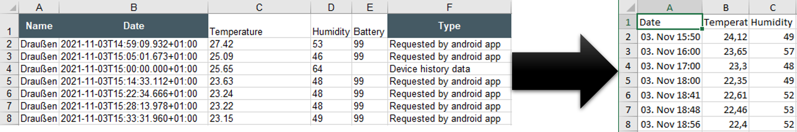

# Mijia Temperature Excel Converter
I use the XIAOMI Mijia Bluetooth thermometer to collect temperature data. To read the data, I use the [Mijia Temperature](https://play.google.com/store/apps/details?id=com.bn.mitemp2) app.

This app offers an Excel export. Unfortunately, I can not do so much with the export - which is certainly due to my lack of Excel knowledge. Therefore, I have programmed this small converter, which brings the data in format, with which I can work.

Since a picture is worth a thousand words, here is a pictorial overview:

Here is an example of conversion:

